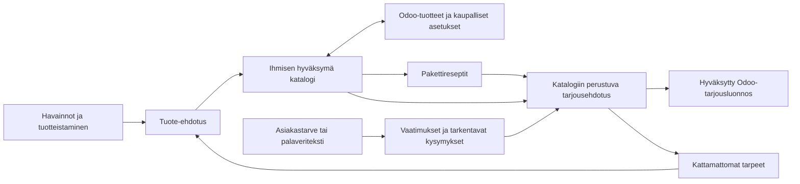

# Palvelupajan yhteinen jatkokehityspolku
Suunnitelma 22.9.2026. Ei toteutuspäätös eikä muutos tuotantoympäristöön.

## Tavoite ja osasuunnitelmat

1. [Modulaarinen tuotekatalogi ja Odoo](suunnitelma-tuotekatalogi.md).
2. [Asiakastarpeesta tarjousehdotukseksi](suunnitelma-tarjousavustaja.md).

Suositus: erotetaan palvelutuote, yhdisteltävä paketti ja asiakaskohtainen tarjous.
Nykyinen palvelukortti voi sisältää kaikkia kolmea. Sitä ei siirretä automaattisesti
uuden katalogin tuotteeksi ilman ihmisen luokittelua. Pieni tuote ei tarkoita yksittäistä
sisäistä työtehtävää: tuotteella pitää olla ostajalle ymmärrettävä lopputulos ja myyntiyksikkö.

## Yhteinen rakenne

### Käsitteet ja tietojen omistajuus

| Käsite | Keskeinen sisältö | Omistaja |
|---|---|---|
| CatalogItem + CatalogVersion | Pysyvä tunniste, sisältö, rajaus, myyntiyksikkö, valintakriteerit, toimitusedellytykset | Palvelupaja: semantiikka ja versiot |
| OdooProductBinding | Kohde, yritys, product.template-ID ja myytävä product.product-ID | Integraatiokerros |
| CommercialSnapshot | Valuutta, yksikkö, hinnasto, verokonteksti, laskutus- ja toimitusasetukset, hakuaika | Odoo; Palvelupaja säilyttää tilannekuvan |
| PackageRecipe + RecipeVersion | Tuoteviitteet, määräsäännöt, vaihtoehdot, pakolliset ja valinnaiset osat | Palvelupaja |
| NeedBrief + Requirement | Alkuperäinen teksti, versio, poimittu tarve ja tekstikohta, epävarmuudet | Palvelupaja |
| Proposal + ProposalLine | Asiakas, lähdeversiot, katalogiversiot, määrät, hinnat, kattavuus, hyväksyntä | Palvelupaja ennen vientiä |
| CatalogGap | Kattamaton tarve, perustelu, brief-viitteet, käsittelytila | Palvelupajan tuotteistamistyöjono |
| ExportRecord | Kohde, tyyppi, versio, idempotenssiavain, ulkoinen ID ja tila | Integraatiokerros |

Odoo omistaa kaupallisen hinnan ja laskutusasetukset. Palvelupajan nykyinen tunnit ×
myyntituntihinta jää uuden tuotteen hinnoitteluehdotukseksi. Sillä ei korvata olemassa
olevan tuotteen asiakaskohtaista hinnastohintaa.

Tuotteilla on pysyvä identiteetti ja erilliset versiot. Hyväksytty versionvaihto päivittää
samaa Odoo-tuotetta erillisellä hyväksytyllä päivitystoiminnolla; jokainen versio ei luo
uutta tuotetta. Vanhat tarjoukset säilyttävät käytetyn sisällön ja hintatilannekuvan.
Product.template ei yksin riitä tarjousriville: varsinainen myytävä variantti tunnistetaan
product.product-tasolla myös yhden variantin tuotteilla.

## Tekninen yhteensopivuus nykyisen kanssa

- Säilytetään FastAPI, React, Pydantic ja adapterirakenne. Ei tarvetta agenttisilmukalle
  tai vektoritietokannalle ensimmäisessä versiossa.
- Lisätään uudet taulut ja skeemaversiot hallituilla migraatioilla. Vanhoja JSON-kortteja,
  analyysisnapshotteja ja vientihistoriaa ei kirjoiteta uudelleen.
- Uudet rajapinnat omiin kokonaisuuksiin: catalog, recipes, briefs, proposals, gaps.
  Nykyiset cards/runs-reitit säilyvät. Uudet ominaisuudet aktivoidaan erikseen.
- Luokittelutyökalu ehdottaa vanhalle kortille: yksittäinen tuote, pakettiresepti tai
  asiakaskohtainen kokonaisuus. Käyttäjä vahvistaa. Vietyä tuotetta ei poisteta.
- Katalogi ladataan rajatusta, käyttäjän valitsemasta Odoo-tuoteryhmästä; DEMO-SVC-suodatin
  ei riitä tulevaan yrityskatalogiin. Käyttöoikeus-, yritys- ja aktiivisuusrajaukset sekä
  sivutus kuuluvat katalogin lukupalveluun.
- Hyväksyntä sidotaan sisältöversion lisäksi katalogi-, kyvykkyys- ja hintatilannekuvaan.
  Muutos niihin vaatii tarkistuksen ja tarvittaessa uuden hyväksynnän.
- Nykyinen paikallinen viennin lukitus säilyy prototyypissä. Ennen luotettavaa
  tarjousvientiä lisätään Odoo-puolen yksilöllinen ulkoinen avain ja transaktionaalinen
  luonti pienessä lisäosassa. Jos lisäosaa ei voida asentaa, epäselvä vienti pysähtyy
  selvitykseen eikä tarkkaa kerran tapahtuvaa luontia luvata.
- XML-RPC:n create ei jäljittele käyttöliittymän onchange-toimintoja. Adapterin
  hintalaskenta ja oletusarvojen muodostus validoidaan Odoon käyttöliittymää vasten;
  tarvittaessa kapseloidaan ne lisäosan rajattuun palvelumetodiin.
- Todelliset palaveritekstit vaativat käyttöoikeudet, säilytysajan, poiston, tietojen
  minimoinnin ja hyväksytyn mallipalvelukäytön. Ennen sitä käytetään synteettisiä tekstejä.

## Ehdotettu aikataulu

Arvio yhdelle kehittäjälle, noin 5–6 keskittynyttä tuntia työpäivässä.
Vaiheet ovat peräkkäisiä; Enterprise-ympäristön järjestäminen voi pidentää kalenteria.

| Vaihe | Työpäivät | Tulos ja riippuvuus |
|---|---:|---|
| 0. Odoo-kartoitus ja yhteiset sopimukset | 2–3 | Testiympäristö, moduulit, kentät, oikeudet, tietomalli |
| 1. Katalogin ensimmäinen versio | 4–6 | Tuoteosat, rajaukset, yksiköt, hyväksyntä, vienti |
| 2. Paketit ja käytännön validointi | 3–5 | Yhdistelysäännöt, 2 koetarjousta käsin Odoossa |
| 3. Tarjousavustaja ilman Odoo-kirjoitusta | 4–6 | Teksti → tarpeet → katalogirivit, kysymykset ja puutteet |
| 4. Hintalaskenta ja tarjousluonnoksen vienti | 3–5 | Odoo-konteksti, hyväksyntä, idempotenssi, luonnos |
| 5. Yhteinen pilotti ja virhetilat | 2–3 | Koko kierto ja regressiot varmennettu |
| **Yhteensä** | **18–28** | Noin 4–6 työviikkoa täysipäiväisesti |

Osa 1 on käyttökelpoinen noin 9–14 työpäivässä. Osa 2 rakennetaan sen päälle seuraavien
9–14 päivän aikana. Jos työaikaa on kaksi päivää viikossa, kokonaisuus on noin 9–14 viikkoa.
Enterprise-lisenssit, ympäristöodotus ja laajat räätälöinnit eivät sisälly työmäärään.
Keskiviikon nykyistä demoa ei kannata korvata tällä uudistuksella viime hetkellä.

## Yhteinen hyväksymisportti

Sama katalogituote on käytettävissä useassa paketissa ja asiakastarjouksessa.
Tarjouksen aukko voi synnyttää tuote-ehdotuksen, mutta ei julkaise tuotetta automaattisesti.
Uuden tuotteen hyväksyntä ei muuta vanhaa tarjousta: käyttäjä päivittää ehdotuksen erikseen.
Palvelupaja ei lähetä tarjousta, vahvista tilausta, käynnistä laskutusta tai luo projekteja
tarjousluonnoksen vientitoiminnosta. Nämä jäävät Odoon normaaliin erilliseen työnkulkuun.
