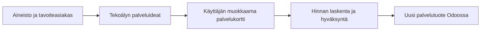

# Palvelupaja — periaate ja käyttöohje

**Versio 0.1 · 21.9.2026 · paikallinen verkkosivupalvelujen demo**

## 1. Mihin sovellus on tarkoitettu?

Palvelupaja auttaa muuttamaan asiakas- ja projektihavaintoja rajatuiksi, myytäviksi palveluiksi. Se kokoaa nykyisen palvelutarjonnan, näyttää havaintojen lähteet ja pyytää tekoälyltä palveluideoita. Käyttäjä arvioi ehdotukset, muokkaa palvelukortin, määrittää hinnan ja hyväksyy sen ennen vientiä Odoohon.

Sovellus tukee tuotteistamispäätöstä. Se ei päätä puolestasi, mikä tuote kannattaa lanseerata, eikä todista kysyntää tai kannattavuutta. Tekoälyn ehdotus voi olla väärä myös silloin, kun siinä oleva lähdeviite on olemassa.

**Vastuunjako:** tekoäly ehdottaa, sovellus laskee ja tarkistaa rakenteen, käyttäjä arvioi sisällön ja hyväksyy viennin.

## 2. Mitä demossa on?

- Lähtöaineistossa 4 palvelua, 6 kuvitteellista asiakasyritystä, 8 projektia ja 4 myyntimahdollisuutta.
- Neljä sisältöviiveprojektia koskee kolmea eri asiakasta. Kaksi projektia onnistui asiakkaan omilla sisällöillä. Yhdessä pääongelma oli integraatio, ja yhdestä on liian vähän tietoa.
- Kaksi käsin laadittua, kuvitteellista kilpailijakorttia. Niiden hinnat eivät ole markkinatutkimusta.
- Käyttäjän muokattava tavoiteasiakas, joka on strateginen valinta ja pidetään erillään havaituista asiakkaista.

Odoo-tilassa palvelukatalogi ja asiakas-, projekti- ja myyntimahdollisuuksien perustiedot luetaan paikallisesta Odoosta. Havaintojen luokittelu, segmentit, työtunnit ja myynnin lopputulosten tutkimusmerkinnät ovat edelleen paikallista synteettistä aineistoa. Odoon käyttö ei muuta aineistoa aidoksi asiakasdataksi.

Käyttötestissä lisättiin palvelu **DEMO – Verkkosivujen sisältöstartti**, joten katalogissa voi nyt näkyä 5 palvelua. Jatkossa onnistuneet viennit kasvattavat palvelujen määrää.

## 3. Avaaminen ja toimintatilat

Avaa **http://127.0.0.1:8000**. Sovelluspalvelimen ja Odoo-tilassa myös Dockerin/Odoon tulee olla käynnissä. Asennus ja käynnistys kuvataan projektin [README-ohjeessa](../README.md).

| Näytön ilmoitus | Mitä se tarkoittaa? |
|---|---|
| Paikallinen Odoo 18 | Sovellus on määritetty käyttämään paikallista Odoota; onnistuneen päivityksen aineisto on haettu siitä. |
| Fixturetila — ei Odoo-yhteyttä | Aineisto ja vienti simuloidaan paikallisesti. |
| OpenAI ja mallin nimi | Ideat syntyivät oikeasta malliajosta. Uusi ajo kuluttaa API-käyttöä. |
| Tallennettu esimerkkivastaus | Valmiiksi kirjoitettu harjoitusvastaus; ei tekoälyn uusi analyysi. |

Odoo-/fixturetila ja OpenAI-/esimerkkitila ovat toisistaan riippumattomia. **Myös esimerkkivastauksesta muodostettu kortti voidaan hyväksyä ja viedä oikeaan paikalliseen Odoohon, jos Odoo-tila on käytössä.** Katso vientipainikkeen nimi ennen vientiä.

## 4. Aineiston tarkistus

1. Avaa **Aineisto** ja paina tarvittaessa **Päivitä**.
2. Tarkista yhteystila ja aineiston hakuaika. Päivitys ei muuta aikaisempien analyysien aineistoa: niihin tallennetaan oma tilannekuva.
3. Tutustu nykyiseen tarjontaan. Listahintaa ei voi verrata suoraan tunti- tai kuukausihintaan. Odoosta haetun palvelun laskutusperuste on tarkistettava erikseen.
4. Avaa projektihavainto. Tarkista alkuperäinen teksti ja lähdetunniste. `OBS` tarkoittaa havaintoa, `PRJ` projektia, `CUS` asiakasta, `SVC` palvelua, `OPP` myyntimahdollisuutta ja `CMP` kilpailijakorttia.
5. Lue myös vastaesimerkit. Sisältöapua ei pidä päätellä tarpeelliseksi asiakkaalle vain siksi, että muilla oli sisältöviiveitä.
6. Kirjoita **Tavoiteasiakas**-kenttään kohderyhmä ja paina **Tallenna tavoite**. Tavoitteen muuttaminen ei muuta jo tallennettuja analyysejä.

## 5. Palveluideoiden muodostaminen

Valitse **Muodosta ideat OpenAIlla**. Sovellus lähettää rajatun synteettisen aineiston ja tavoiteasiakkaan mallipalveluun. Odota vastauksen valmistumista; testeissä analyysi kesti kymmeniä sekunteja. Älä käynnistä uutta ajoa vain siksi, ettei vastaus tule heti.

Saat 2–3 ideaa. Tarkista jokaisesta:

- Todistaako mainittu lähde ongelman vai onko se vain aiheeseen liittyvä havainto?
- Onko ehdotus nykyisen tuotteen kopio vai perusteltu parannus?
- Sopiiko kohdeasiakas todella valitsemaasi tavoitteeseen?
- Näkyvätkö vastaesimerkit, oletukset ja avoimet kysymykset?
- Esitetäänkö tavoiteltu hyöty liian varmana lupauksena?

Klikkaa lähdetunnisteita nähdäksesi aineiston. Valitse sopiva idea painamalla **Muotoile palvelukortti**. Tämä tekee erillisen mallikutsun. Analyysihistoriasta voit avata aikaisemman ajon ilman uutta analyysikutsua.

Jos havaintoja on alle kahdesta riittävän dokumentoidusta projektista, ideointi estetään. Raja on tämän demon käytännön varmistus, ei tilastollinen näyttö riittävästä otoksesta.

**Ilman mallipalvelua:** valitse **Avaa tallennettu esimerkkivastaus**. Se harjoittaa samaa käyttöpolkua, mutta ei analysoi muuttunutta tavoiteasiakasta uutena malliajona.

## 6. Palvelukortin muokkaaminen

Täydennä nimi, myyntikuvaus, kohdeasiakas, hyöty, toimitussisältö, rajaukset, lähtötiedot, toimitusvaiheet, hinnoittelumalli ja hinnan perusteet. Muokkaa tarvittaessa myös lähdetunnisteita ja avoimia kysymyksiä.

Hyvä toimitussisältö kertoo määrät ja lopputuloksen: esimerkiksi ”yksi kahden tunnin työpaja, enintään viiden sivun sisältörungot ja yksi kommentointikierros”. Rajauksissa kerrotaan, etteivät tekninen toteutus tai jatkuva ylläpito sisälly pakettiin.

Syötä **Arvioitu työmäärä** ja **Myyntihinta / tunti**. Paina **Tallenna luonnos**. Hinta lasketaan vasta tallennettaessa:

> 8 tuntia × 95 €/h = 760 € veroton myyntihinta.

Tuntihinta on myyntihinta, ei työn kustannus. Laskelma ei sisällä katetta, kustannuksia eikä verojen laskentaa. Demon ”alv 0 %” -merkintä tarkoittaa verotonta lähtöhintaa, ei palvelun verovapauden määritystä. Odoo-tuotteen veroasetukset tarkistetaan Odoossa erikseen. Hinnoittelumallin tekstikenttä ei luo Odoohon tilausta tai toistuvaa laskutusta.

Tallentamattomat muutokset eivät ole tietokannassa. Tallenna ennen kortin vaihtamista tai sivun sulkemista. Uudessa välilehdessä tehty muutos voi aiheuttaa versioristiriidan; avaa silloin kortti uudelleen.

## 7. Hyväksyntä ja vienti

1. Tarkista tallennettu sisältö ja hinta.
2. Paina **Hyväksy versio N**. Hyväksyntä koskee juuri tätä sisältöversiota.
3. Jos muokkaat ja tallennat vielä tämän jälkeen, kortti palaa luonnokseksi ja tarvitsee uuden hyväksynnän.
4. Paina **Vie Odoohon**. Fixturetilassa painikkeen nimi on **Simuloi vienti**.
5. Onnistunut vienti näyttää tuotekoodin. Paina **Avaa Odoossa** ja kirjaudu tarvittaessa paikalliseen Odoohon.
6. Tarkista nimi, palvelutyyppi, myyntikuvaus ja listahinta Odoon tuotenäkymästä.

Odoohon viedään nimi, palvelutyyppi, myyntikuvaus toimitussisältöineen, rajauksineen, lähtötietoineen ja vaiheineen, hyväksytty hinta sekä oma tuotekoodi. Analyysin lähteet, tavoiteasiakas, oletukset ja korttihistoria säilyvät Palvelupajassa; kaikki kentät eivät siirry Odoohon.

Saman version vienti uudelleen palauttaa saman tuotteen. Viety kortti lukittuu. Jos haluat uuden ehdotuksen, luo ideasta uusi kortti; tämä tarkoittaa myös mahdollista uutta Odoo-tuotetta, ei vanhan tuotteen automaattista päivitystä.

## 8. Häiriötilanteet

| Tilanne | Toimi näin |
|---|---|
| Aineisto ei lataudu | Tarkista Docker ja Odoo. Paina Päivitä, kun yhteys toimii. |
| OpenAI-avain puuttuu | Lisää avain paikalliseen `.env`-tiedostoon ja käynnistä sovelluspalvelin uudelleen. Älä lähetä avainta keskusteluun. |
| Saldo tai kiintiö loppu | Tarkista API-projektin laskutus. Esimerkkitila toimii ilman mallikutsua. |
| Mallivastaus hylätään | Virheellistä lähdettä tai rakennetta ei tallenneta. Tarkista aineisto ja yritä tarvittaessa kerran uudelleen. |
| Hyväksyntä ei onnistu | Täytä nimi, kuvaus, sisältö, rajaukset, lähteet sekä positiivinen työmäärä ja tuntihinta. Tallenna ensin. |
| Vienti jäi epäselväksi | Paina vientiä uudelleen tuloksen selvittämiseksi. Sovellus etsii aiemmin luotua tuotetta. Jos sitä ei löydy, älä kierrä estoa uudella kortilla; pyydä tekninen tarkistus. |
| Odoo ei lähetä käyttäjäkutsua | Paikallinen kirjautuminen ei tarvitse sähköpostia, jos ylläpitäjä on asettanut käyttäjälle salasanan. |

## 9. Nykyiset rajat

Demo toimii paikallisesti ja yhdelle käyttäjälle. Siinä ei ole yrityksen tuotantoyhteyttä, automaattista kilpailijatiedon keruuta, oikeaa asiakasprofilointia, taattua faktantarkistusta tai kannattavuusmallia. Testattu Community-ympäristö ei varmista työnantajan Enterprise-räätälöintien yhteensopivuutta.

Tekniset varmennukset ja jäljellä olevat laatuhavainnot ovat [testiraportissa](evaluation.md). Kehittäjän kuvaus on [teknisessä dokumentaatiossa](tekninen-dokumentaatio.md).
