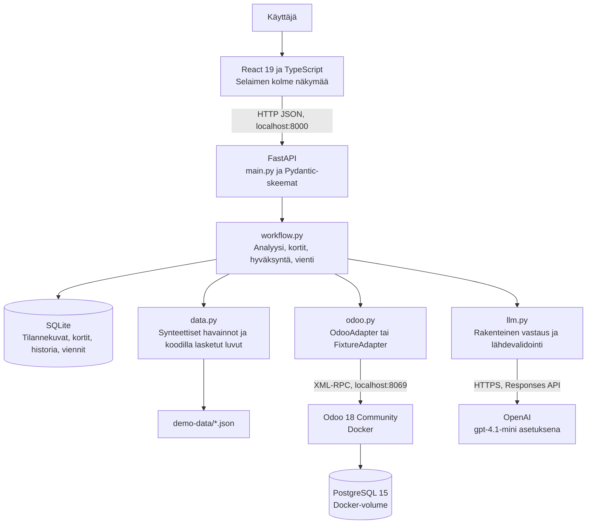
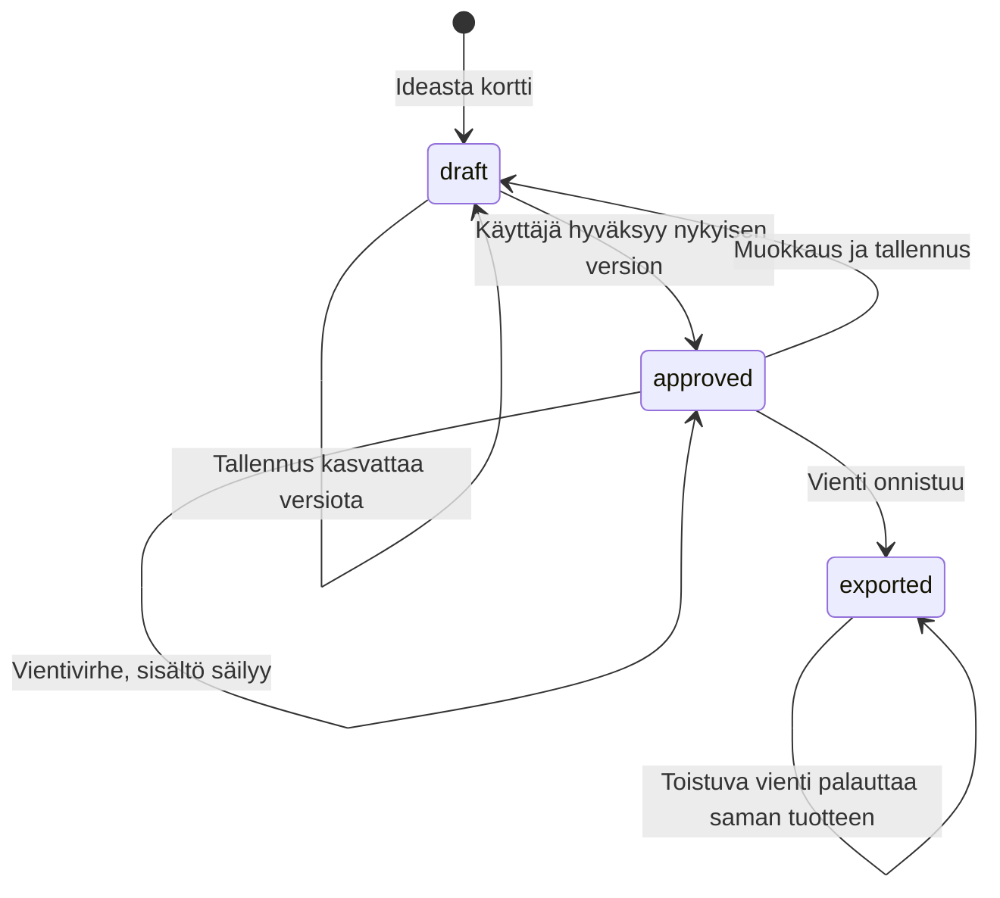
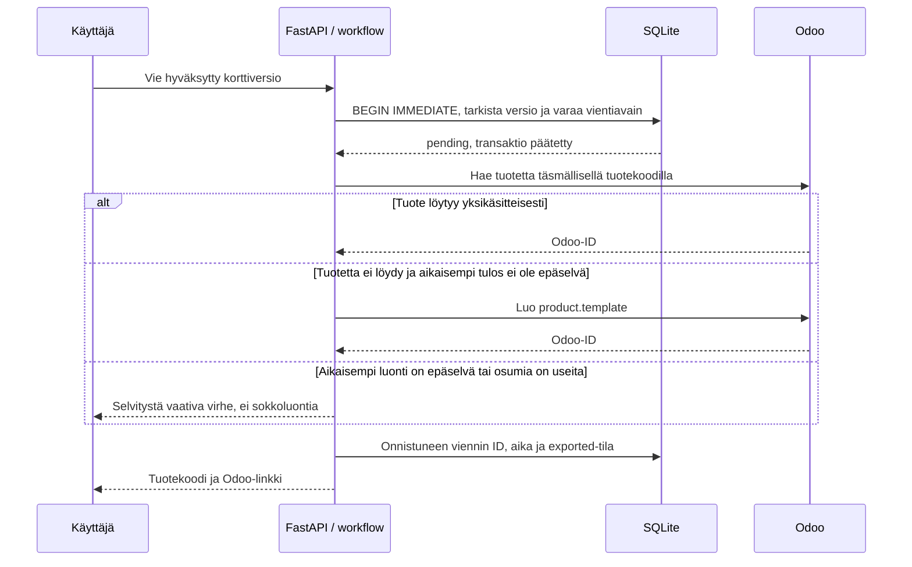
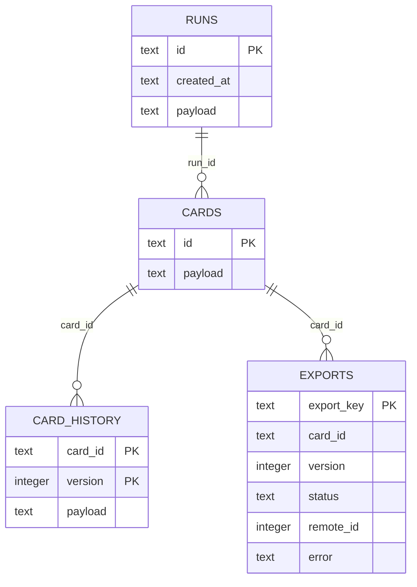

# Palvelupaja — tekninen dokumentaatio

**Versio 0.1 · 21.9.2026 · lähdekoodia vastaava kuvaus**

## 1. Rajaus ja vastuut

Paikallinen yhden käyttäjän prototyyppi, jossa tuotteistamisen työnkulku yhdistää Odoo 18 Communityn, OpenAI Responses API:n ja SQLite-tallennuksen. Aineisto on synteettistä. Frontend ei saa Odoo- tai OpenAI-avaimia, eikä kielimallilla ole kirjoittavia työkaluja.

Koodi laskee määrät ja hinnat, validoi rakenteet, hallitsee versiot sekä tekee viennin. Malli ehdottaa tekstiä. Käyttäjä tarkistaa sisällön ja hyväksyy tietyn version. Hyväksyminen on paikallisen työnkulun tila, ei tunnistetun organisaatiokäyttäjän allekirjoitus.

## 2. Rakennekaavio



Sovelluspalvelin tarjoilee myös frontendin valmiin `dist`-hakemiston. Kehityksessä Vite kuuntelee porttia 5173 ja välittää `/api`-pyynnöt porttiin 8000. Compose sisältää vain Odoon ja PostgreSQL:n; backend ja frontend-kehityspalvelin suoritetaan hostilla.

## 3. Hakemistorakenne

```text
backend/
  app/
    main.py        HTTP-reitit, virhevastaukset, ympäristö ja static files
    schemas.py     Pydantic-mallit ja syötteen validointi
    workflow.py    Tilannekuva, analyysi, korttiversiot ja vienti
    data.py        Fixturevalidointi, tunnisteet ja laskettavat faktat
    store.py       SQLite-yhteydet ja taulujen alustus
    odoo.py        Paikallinen XML-RPC- ja fixture-adapteri
    llm.py         OpenAI, promptit ja esimerkkivastaus
  tests/           Maksuttomat työnkulku- ja adapteritestit
  requirements.lock.txt
frontend/
  src/main.tsx     Kolme näkymää, lomakkeet, lähdeikkuna, tilailmoitukset
  src/style.css    Responsiivinen ulkoasu
  package-lock.json
  dist/           Koostettu käyttöliittymä
demo-data/        Deterministinen aineisto ja merkitty esimerkkivastaus
scripts/
  build_fixtures.py  Synteettisen lähdeaineiston muodostus
  seed.py           Paikallinen validointi ja --odoo-alustus
  evaluate.py       Todelliset malliarvioinnit
  start.ps1         Paikallinen yhden prosessin käynnistys
docs/            Ohjeet, kaaviot ja todelliset testitulokset
data/app.db      Paikallinen sovellustietokanta, ei versionhallintaan
.env             Paikalliset asetukset ja avaimet, ei versionhallintaan
compose.yaml     Odoo 18 ja PostgreSQL 15
```

## 4. Tiedonkulku ja analyysin toistettavuus

`workflow.snapshot()` hakee katalogin, asiakkaat, projektit ja myyntimahdollisuudet adapterin kautta. Se yhdistää niihin paikalliset havainnot, kilpailijakortit ja käyttäjän tavoiteasiakkaan. `data.facts()` laskee projektit, erilliset asiakkaat, sisältöviiveet ja segmenttijakauman koodilla. Tavoiteprofiili ei korvaa havaittua jakaumaa.

Analyysiin tallentuvat aineistoversio, hakuaika, käytetty lähdeaineisto, ideat, tila (`live`/`example`), mallin nimi, promptiversio, kesto ja saatavilla oleva tokenkulutus. Vanha analyysi ei muutu, kun Odoo-dataa päivitetään. Malliajo ei ole deterministinen; tallennettu vastaus on näyttö juuri kyseisestä ajosta.

Havaintojen lainaukset tarkistetaan alkuperäisistä synteettisistä projektimuistiinpanoista. Odoo-tilassa projektin perustiedot ja paikallinen tutkimusannotaatio yhdistetään tunnistekartalla. Annotaatioiden automaattista päivittymistä Odoon muistiinpanojen muuttuessa ei toteuteta.

## 5. OpenAI-integraatio ja laadun rajat

`OpenAI.responses.parse()` käyttää Pydanticin `Ideas`- ja `CardContent`-malleja, `store=False`-asetusta, 60 sekunnin aikakatkaisua, yhtä SDK-uusintayritystä ja 4500 output-tokenin rajaa. Malli on ympäristömuuttujassa. `Ideas` vaatii 2–3 ideaa; ylimääräiset kentät hylätään. Tunnisteiden on oltava yksilöllisiä ja tukevien lähdeviitteiden ei-tyhjiä. Kaikkien lähde-ID:iden on löydyttävä tilannekuvasta.

Promptiversio `productization-2` erottaa ohjeet aineistosta, kieltää keksityt hinnat ja kannattavuusväitteet sekä täsmentää vastaesimerkkien ja tavoiteasiakkaan eroa. Varsinaista semanttista faktantarkistajaa ei ole. Malli voi yhä liioitella näyttöä tai ehdottaa nykyisen palvelun kaltaista tuotetta.

Ennen ideointia vaaditaan informatiivisia havaintoja vähintään kahdesta eri projektista tai yleisestä muistiinpanosta; `insufficient_data`-aiheiset havainnot eivät täytä rajaa. Tämä on demon deterministinen varmistus, ei tilastollinen luottamusraja. Tyhjä tai liian vähäinen aineisto hylätään ennen maksullista kutsua. Virheellinen mallivastaus ei korvaudu automaattisesti esimerkkivastauksella.

## 6. Odoo-adapteri

| Sovelluksen tieto | Odoo-malli | Toteutustapa |
|---|---|---|
| Palvelut | `product.template` | DEMO-SVC-tuotekoodilla rajattu oikea katalogiluku |
| Asiakkaat | `res.partner` | Seed-kartan ID:t ja eksplisiittiset kentät |
| Projektit | `project.project` | Odoon perustiedot + paikalliset tutkimusannotaatiot |
| Myyntimahdollisuudet | `crm.lead` | Odoon perustiedot + paikalliset tutkimustulokset |

`fields_get` tarkistaa kentät ja palvelutyypin teknisen arvon. `search_read` käyttää eksplisiittisiä kenttiä, domain-rajausta, ID-järjestystä ja 200 tietueen enimmäismäärää. Tämä on demolle riittävä; tuotantokäyttö tarvitsee sivutuksen.

Autentikointi tapahtuu `/xmlrpc/2/common`-rajapinnassa ja mallikutsut `/xmlrpc/2/object`-rajapinnassa. Versioksi hyväksytään Odoo 18. Kohteeksi sallitaan vain paikallinen host tai Compose-palvelun nimi `odoo`, tietokannaksi `productization_demo`. Kutsuilla on 15 sekunnin aikakatkaisu. Synkroniset FastAPI-reitit suoritetaan säiepoolissa, joten XML-RPC ei blokkaa asynkronista tapahtumasilmukkaa.

Seed tunnistaa tietueet pysyvillä DEMO-tunnisteilla ja tallentaa `seed_map`-tauluun kohde + source_id → Odoo-ID. Uusinta päivittää samat demotietueet. Se voi siis korvata käyttäjän kyseisiin alustustietueisiin tekemät muokkaukset. Viedyt uudet tuotteet eivät kuulu alkuperäiseen seed-joukkoon.

Vienti kirjoittaa vain nimen, palvelutyypin, myyntikuvauksen, listahinnan ja tuotekoodin. Kuvaus sisältää toimitussisällön, rajaukset, lähtötiedot ja vaiheet. Odoo-valuutta oletetaan tässä demossa euroksi, veroasetuksia tai jatkuvaa laskutusta ei määritetä vientikutsussa.

## 7. Kortin ja viennin tilat



Hinta lasketaan `Decimal(hours * hourly_rate)`-laskennalla senttiin `ROUND_HALF_UP`-pyöristyksellä. Hyväksyntä vaatii positiivisen hinnan, lähteet sekä ei-tyhjät nimen, kuvauksen, toimitussisällön ja rajaukset. Muokkaus tarkistaa `expected_version`-arvon ja palauttaa kortin luonnokseksi. Viety kortti on lukittu.



Vientiavaimessa on kohde, kortin ID ja versio. Tuotekoodi on `DEMO-SVC-{kortin ID:n alku}-V{versio}`. Paikallinen kirjoituslukko ja yksilöllinen vientiavain estävät saman sovelluksen rinnakkaiset luontiyritykset. `pending` estää uuden yrityksen, `uncertain` sallii vain tuloksen selvittämisen haulla. Verkossa epäselväksi jääneen luontiyrityksen jälkeen ei luoda automaattisesti uutta tuotetta.

Odoon tuotekoodi ei ole tietokantatasolla yksilöllinen eikä Odoo-kirjoitus ole samassa transaktiossa SQLite-kirjoituksen kanssa. Tämä ei ole hajautettu exactly-once-takuu. Aja vain yksi backend-prosessi: käynnistys muuttaa vanhat `pending`-rivit `uncertain`-tilaan.

## 8. Tallennusmalli



Kaavion suhteet ovat sovellustason suhteita; nykyisessä skeemassa ei ole niitä vastaavia SQL-viiteavaimia. Lisäksi `settings` säilyttää tavoiteprofiilin, `seed_map` Odoo-tunnistekartan ja `fixture_products` simuloidut tuotteet. JSON-payloadit ovat tarkoituksellinen prototyyppiratkaisu. Sisältöversiot säilyvät, mutta saman version tilamuutokset päivittävät historian riviä: täydellistä muuttumatonta tapahtumalokia ei ole.

## 9. HTTP-rajapinta

| Metodi ja polku | Käyttö |
|---|---|
| GET `/api/health` | Asetettu tila, mallin nimi, avaimen olemassaolo; ei ulkoisten palvelujen kattava terveystesti |
| GET `/api/data` | Tuore Odoo-/fixturetilannekuva |
| PUT `/api/profile` | Tavoiteprofiilin tallennus |
| POST `/api/runs` | Uusi live- tai esimerkkianalyysi |
| GET `/api/runs` | 20 viimeisintä analyysiä |
| GET `/api/runs/{id}` | Analyysin täydellinen tilannekuva |
| POST `/api/cards` | Kortti valitusta analyysistä ja ideasta |
| GET `/api/cards` ja `/api/cards/{id}` | Kortit ja yksittäinen kortti |
| PUT `/api/cards/{id}` | Sisällön muokkaus ja hinnan laskenta |
| POST `/api/cards/{id}/approve` | Nykyisen version hyväksyntä |
| POST `/api/cards/{id}/export` | Vienti tai epäselvän viennin selvitys |

422 tarkoittaa virheellistä syötettä tai hylättyä analyysiä, 409 versiota/tilaa koskevaa ristiriitaa, 404 puuttuvaa tietuetta ja 502 integraatiovirhettä. Tietueita poistavaa rajapintaa ei ole. OpenAPI-kuvaus löytyy paikallisesti `/docs`-osoitteesta.

## 10. Käynnistys, turvallisuus ja ylläpito

Asennuskomennot ja ympäristömuuttujat ovat [READMEssa](../README.md). `.env` luetaan projektin juuresta; prosessin olemassa olevat ympäristömuuttujat ovat ensisijaisia. Asetusmuutos edellyttää backendin uudelleenkäynnistystä. Avaimia ei tallenneta frontend-koosteeseen, dokumentteihin tai mallisyötteeseen.

Palvelin sidotaan 127.0.0.1:8000:aan, Odoo 127.0.0.1:8069:ään ja PostgreSQL jää Compose-verkkoon. Host- ja Origin-tarkistukset rajaavat selainpyyntöjä, mutta eivät korvaa kirjautumista. Paikalliset muut ohjelmat voivat käyttää APIa. Sovellusta ei tule avata julkiseen verkkoon tässä muodossa.

Varmuuskopioi sovelluksen SQLite-tiedosto ja Odoon tietokanta/filestore hallitusti palvelujen ollessa pysäytettyinä tai käyttäen tietokantojen omaa varmistusmenetelmää. Säilytä `.env` erillään ja suojattuna. `docker compose stop` säilyttää volumet; `down -v` poistaa ne eikä kuulu normaaliin pysäytykseen.

Testattu backend käyttää Python 3.12.5:tä. JavaScript-riippuvuudet ovat lukittuja ja kooste on tehty Node 24.19.0:lla / Vite 7.3.6:lla. Docker-kuvien tarkat digestit eivät ole tässä raportissa todennettuja: agentin Docker-hallintayhteys on rajattu, vaikka Odoon HTTP/XML-RPC-yhteys toimii.

## 11. Varmennukset ja jatkokehitys

Katso [testiraportti](evaluation.md), [malliarviointien tulokset](evaluation-results.json) ja [integraation tulos](integration-results.json). Maksuttomat testit ajetaan komennolla `python -m pytest backend/tests -q`. `scripts/evaluate.py` tekee maksullisia mallikutsuja, lukuun ottamatta ennalta estettyä vähäisen aineiston tapausta.

Seuraavat kehityskohteet ovat semanttisen lähdeuskollisuuden arviointi, aidon datan luvat ja minimointi, Enterprise-kenttäkartoitus, valuutta/verot, kirjautuminen, tietokantamigraatiot, muuttumaton audit trail, sivutus, Odoo-puolen idempotenssi ja synkronoinnin konfliktit. Kilpailijahaku ja aineiston automaattinen tulkinta ovat erillisiä tulevia ominaisuuksia.


## Aineistopäivitys 22.9.2026

Käytössä on JJ-dataset2.json. Yllä olevat alkuperäisen demon lukumäärät ja testitulokset kuvaavat aiempaa aineistoa. Uuden aineiston määrät, vaihto ja yleisten muistiinpanojen käsittely on kuvattu [README-ohjeessa](../README.md#aineiston-vaihto-2292026). Promptiversio on nyt productization-3.


## Aineistolähtöinen ideointi (22.9.2026)

Promptiversio productization-4 ei oleta toimialaa tai suosi tiettyä palvelutyyppiä.
Sisältöviiveen erikoismittari on korvattu kaikkien aineistossa annettujen aiheiden
yhteenvedolla: havaintojen, erillisten projektien, erillisten asiakkaiden ja yleisten
muistiinpanojen määrät. Aiheet eivät ole mallin löytämiä eivätkä määrät osoita kysyntää.

Asiakasnäkymä näyttää asiakkaan tavoitteen. Muut lähdekentät, myös mahdollinen
sisältöosaaminen, ovat yhä lähdeikkunassa ja mallin aineistossa. Sisällöntuotantoa
ei kielletä, jos aineisto todella tukee sitä; se ei enää ole ohjelman ennakko-oletus.
Sisäinen kehityshavainto ei itsessään osoita ulkoista asiakaskysyntää.

Käynnistä backend uudelleen ja päivitä selain. Luo uusi analyysi: vanhat analyysit,
palvelukortit, Odoo-tuotteet ja alkuperäisen aineiston merkitty esimerkkivastaus eivät
muutu. Tietokantamigraatiota tai uutta seed-ajoa ei tarvita.
Rajapinnan facts.content_delay_* on korvattu facts.topics-rakenteella;
tallennettuja vanhoja tilannekuvia ei muuteta.

Varmennus: 16 automaattista testiä sekä TypeScript-tarkistus ja Vite-kooste.
Uuden promptin sisällöllistä laatua ei ole tässä muutoksessa arvioitu oikealla
malliajolla. Ihmisen tarkistus tarvitaan edelleen.
